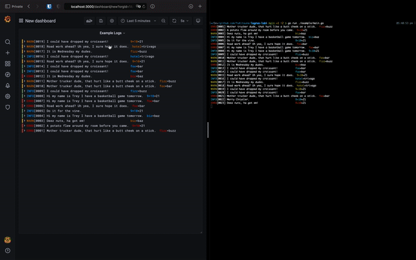

<h1 align="center">
  Logrus + Loki = ❤️
</h1>

<h3 align="center">
  A <a href="https://grafana.com/oss/loki/">Loki</a> hook for <a href="https://github.com/Sirupsen/logrus">Logrus</a>

[](https://github.com/yukitsune/lokirus/actions?query=workflow:Build%20and%20Test)
[](https://goreportcard.com/report/github.com/yukitsune/lokirus)
[](https://github.com/YuKitsune/lokirus/blob/main/LICENSE)
[](https://github.com/YuKitsune/lokirus/releases)
[](https://pkg.go.dev/mod/github.com/yukitsune/lokirus)

  
</h3>

# Installation

```sh
go get github.com/yukitsune/lokirus
```

# Usage

```go
package main

func main() {

	// Configure the Loki hook
	opts := lokirus.NewLokiHookOptions().
		// Grafana doesn't have a "panic" level, but it does have a "critical" level
  // https://grafana.com/docs/grafana/latest/explore/logs-integration/
		WithLevelMap(lokirus.LevelMap{logrus.PanicLevel: "critical"}).
    WithFormatter(&logrus.JsonFormatter{})
		WithStaticLabels(lokirus.Labels{
			"app":         "example",
			"environment": "development",
		}).
		WithBasicAuth("admin", "secretpassword") // Optional

	hook := lokirus.NewLokiHookWithOpts(
		"http://localhost:3100",
		opts,
		logrus.InfoLevel,
		logrus.WarnLevel,
		logrus.ErrorLevel,
		logrus.FatalLevel)

	// Configure the logger
	logger := logrus.New()
	logger.AddHook(hook)

	// Log all the things!
  logger.WithField("fizz", "buzz").Warnln("warning")
}
```

# Contributing

Contributions are what make the open source community such an amazing place to be, learn, inspire, and create.
Any contributions you make are **greatly appreciated**!
